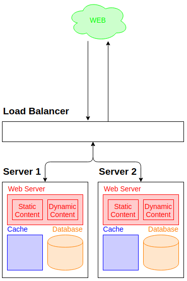
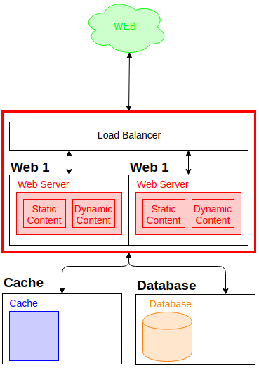
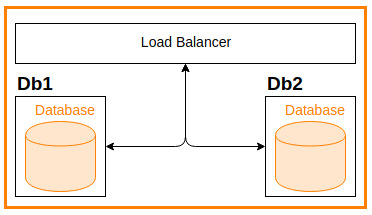
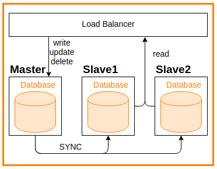
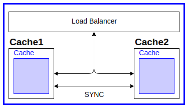
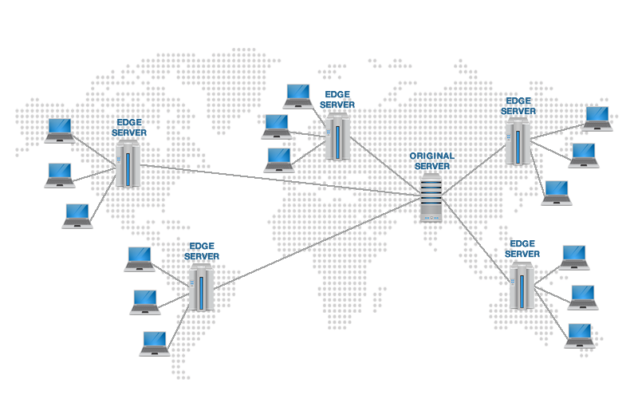
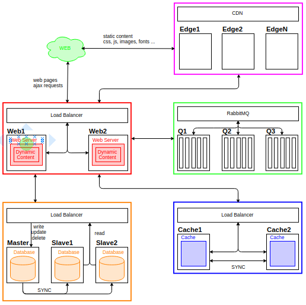

### Lunch and Learn

Web Infrastructure

_Make it scalable_

---

### Summary

- One machine to serve them all
- Splitting traffic
- Database replication
- Caching
- CDNs
- Other possible performance tricks (bonus)

---

### One machine to serve them all

- What happens in the VM?
- What are the component required to serve a regular web application?

---


---

What are the limits of the VM?

Benchmarking with
- siege
- ab

---

sample siege output
```
Transactions:		        5200 hits
Availability:		      100.00 %
Elapsed time:		      355.05 secs
Data transferred:	      123.09 MB
Response time:		        2.74 secs
Transaction rate:	       14.65 trans/sec
Throughput:		        0.35 MB/sec
Concurrency:		       40.12
Successful transactions:        5200
Failed transactions:	           0
Longest transaction:	      192.25
Shortest transaction:	        0.01
```

---

Questions:

- Can we reduce average response time (less than 2.74sec)?
- Can we increase concurrency (more than 40 users at a time)?
- Can we increase average transaction rate (more than 15 tx/sec)?
- Can we ensure 0 failed transactions?

---

### Splitting traffic

- Multiple servers to improve performances
- Use of Load Balancer to split traffic
- Make sure dead servers are not used

---



---



---

### Database Replication

- multiple servers = better performances overall
- load balancer to ensure dead servers are not used

---

### Database cluster



---

### Database cluster



---

### Master/Slave limitations

- What happens when the master server is down?

---

### Master/Slave limitations

- What happens when the master server is down?
    - use of master/master setup
    - use of +10 increments to prevent collisions

---

### Master/Slave limitations

- What happens when sync fails

---

### Master/Slave limitations

- What happens when sync fails
    - importance of NOT write then read in code
    - if needed, use a SQL transaction

---

### Cache management

- Cache in files locally on web servers
- Cache in DB
- Cache in RAM using Memcache
- Cache in RAM using Redis
- Master/Master setup

---

### Cache management



---

### Content Delivery Networks

- CSS and JS content on separate servers
- Use different URLs for different physical servers
- Issues for cache invalidation
    - different file names
    - add a tag/version as part of the query string

---

### CDN



---

### Recap



---

### Other tricks

- HTML caching (Varnish, hole punching)
- multiply urls for static content if there's a lot
- CSS Sprites
