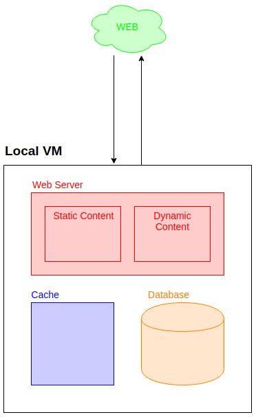

### Lunch and Learn

Web Infrastructure

_Make it scalable_

---

### Summary

- One machine to serve them all
- Splitting traffic
- Database replication
- Caching
- CDNs
- Other possible performance tricks (bonus)

---

### One machine to serve them all

- What happens in the VM?
- What are the component required to serve a regular web application?

---



---

What are the limits of the VM?

Benchmarking with
- siege
- ab

---

sample siege output
```
Transactions:		        5200 hits
Availability:		      100.00 %
Elapsed time:		      355.05 secs
Data transferred:	      123.09 MB
Response time:		        2.74 secs
Transaction rate:	       14.65 trans/sec
Throughput:		        0.35 MB/sec
Concurrency:		       40.12
Successful transactions:        5200
Failed transactions:	           0
Longest transaction:	      192.25
Shortest transaction:	        0.01
```

---

Questions:

- Can we reduce average response time (less than 2.74sec)?
- Can we increase concurrency (more than 40 users at a time)?
- Can we increase average transaction rate (more than 15 tx/sec)?
- Can we ensure 0 failed transactions?

---

### Splitting traffic

- Load Balancing web traffic
- Isolation of web servers


